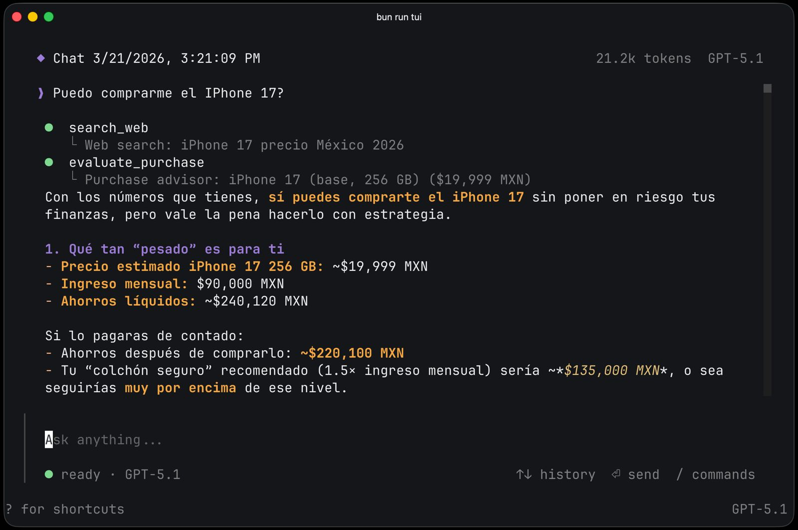

<div align="center">

# openfin

**AI-powered personal finance assistant that runs entirely on your machine.**

[](https://www.npmjs.com/package/openfin-ai)
[](LICENSE)
[](https://github.com/eigencore/openfin/actions)

Track accounts, credit cards, debts, budgets, goals, and investments through a natural conversation —
no cloud, no subscriptions, no spreadsheets.



</div>

## Installation

**curl** — macOS / Linux (installs a native binary to `~/.local/bin`)
```bash
curl -fsSL https://raw.githubusercontent.com/eigencore/openfin/main/install.sh | bash
```
> If `~/.local/bin` is not in your `$PATH`, the installer will tell you what to add to your shell profile.

**npm** — all platforms including Windows (requires Node.js ≥ 18)
```bash
npm install -g openfin-ai
```

**From source** (requires [Bun](https://bun.sh) ≥ 1.3)
```bash
git clone https://github.com/eigencore/openfin
cd openfin && bun install
bun run dev   # starts the HTTP server on port 4096
```

After installing, run `openfin auth login` to configure your API key — see **[Setup](#setup)** below.

## Setup

Use the interactive auth command to configure your API keys — no environment variables needed:

```bash
openfin auth login
```

Select a provider (Anthropic, OpenAI, Google, Groq…) and paste your API key. Keys are stored in `~/.openfin/auth.json` with `600` permissions.

```bash
openfin auth list     # show configured credentials
openfin auth logout   # remove a credential
```

OpenFin defaults to `claude-sonnet-4-5` and falls back to `gpt-4o` if no Anthropic key is found.

You can also set keys via environment variables (takes priority over stored credentials):

```bash
export ANTHROPIC_API_KEY=sk-ant-...
export OPENAI_API_KEY=sk-...
```

## Usage

The `openfin` binary uses subcommands. **The server must be running first** — all clients connect to it.

```
openfin            # start the HTTP server (port 4096)
openfin tui        # full-screen terminal UI
openfin chat       # readline REPL
openfin telegram   # Telegram bot
openfin auth       # manage AI provider API keys
```

**TUI (recommended)**
```bash
openfin          # Terminal 1 — start the server
openfin tui      # Terminal 2 — open the UI
```

**CLI REPL**
```bash
openfin                               # Terminal 1 — start the server
openfin chat                          # Terminal 2
openfin chat --session <id>           # resume a session
openfin chat --model openai:gpt-4o    # pick a model
```

**Telegram**
```bash
openfin telegram login           # one-time setup: paste your token from @BotFather
openfin                          # Terminal 1 — start the server
openfin telegram                 # Terminal 2 — start the bot
```

Each Telegram user gets an isolated session. TUI and Telegram can run simultaneously against the same server.

**REST API** — `http://localhost:4096`
```
GET  /provider                  list available providers
POST /session                   create a session
POST /session/:id/message       send a message (NDJSON stream)
GET  /event                     SSE event stream
```

## What it tracks

| Category | Details |
|---|---|
| **Accounts** | Checking, savings, investment, cash. Balance updated on every transaction. |
| **Credit cards** | Accounts with negative balance. Purchases update the balance; end-of-month payment is a transfer. |
| **Installment plans** | MSI (meses sin intereses) tracked as fixed loans with monthly payments. |
| **Debts** | Personal loans, car loans, mortgages — with APR, minimum payment, and due day. |
| **Budgets** | Per-category monthly or weekly limits. Shows used vs. limit in real time. |
| **Goals** | Savings targets with progress tracking and optional target date. |
| **Transactions** | Income and expense log linked to accounts, filterable by period, category, or account. |
| **Portfolio** | Stocks, ETFs, crypto — quantity, average cost, and live P&L via `get_price`. |
| **Recurring** | Auto-logged transactions on a daily/weekly/monthly/yearly schedule. |
| **Net worth** | Daily snapshot of assets minus debts, with historical trend. |

## Tools

| Tool | What it does |
|---|---|
| `log_transaction` | Records income or expense and updates account balance |
| `upsert_account` | Creates or updates a bank account or credit card |
| `upsert_debt` | Creates or updates a loan, mortgage, or installment plan |
| `transfer_between_accounts` | Moves money between accounts (e.g. paying a credit card) |
| `pay_debt` | Applies a payment to a loan and debits the source account |
| `upsert_budget` | Sets a spending limit for a category |
| `upsert_goal` | Creates or updates a savings goal |
| `contribute_to_goal` | Adds to a goal's progress and debits the source account |
| `analyze_expenses` | Spending breakdown by category for a given period |
| `list_transactions` | Filters and lists individual transactions |
| `get_net_worth` | Current net worth and historical trend |
| `check_alerts` | Flags budget overruns, high-APR debt, and goal risks |
| `create_recurring` | Sets up a recurring income or expense |
| `add_position` | Adds a stock/ETF/crypto position to the portfolio |
| `get_price` | Fetches a live market price |

## Architecture

```
src/
├── index.ts      # entry point — subcommand dispatch
├── server/       # Hono HTTP server (port 4096) — REST + SSE
├── session/      # LLM chat loop — streams responses, runs tool loop
├── provider/     # LLM abstraction — Anthropic, OpenAI, Google, Groq, Mistral, xAI, OpenRouter
├── tool/         # tool definitions and registry
├── profile/      # financial data layer — accounts, transactions, debts, budgets, goals
├── storage/      # SQLite via Drizzle ORM (WAL mode, auto-migrations)
├── bus/          # pub/sub event system — drives SSE stream
├── tui/          # Solid.js terminal UI
├── cli/          # readline REPL client
└── telegram/     # Telegram bot (grammy)
```

Data flow:
```
User → TUI / CLI / Telegram
  → POST /session/:id/message
  → session.chat() → LLM Provider
  → Tool execution → Profile (SQLite)
  → Bus events → SSE stream → Client
```

Data is stored at `~/.openfin/openfin.db`. Migrations apply automatically on server start.

## Development

Requires [Bun](https://bun.sh) ≥ 1.3.

```bash
bun install

bun run dev        # HTTP server — Terminal 1
bun run tui        # terminal UI — Terminal 2
bun run chat       # CLI REPL   — Terminal 2
bun run telegram   # Telegram   — Terminal 2

bun run typecheck
bunx drizzle-kit generate   # generate migration after schema changes
```

## Configuration

| Variable | Default | Description |
|---|---|---|
| `ANTHROPIC_API_KEY` | — | Anthropic API key (primary provider) |
| `OPENAI_API_KEY` | — | OpenAI fallback |
| `TELEGRAM_BOT_TOKEN` | — | Telegram bot token — or use `openfin telegram login` |
| `OPENFIN_SERVER` | `http://localhost:4096` | Server URL used by TUI, CLI, and Telegram |
| `PORT` | `4096` | HTTP server port |

## Release

```bash
git tag v0.1.0
git push --tags
```

Builds native binaries for darwin-arm64, darwin-x64, linux-arm64, linux-x64, and windows-x64,
publishes them to npm, and creates a GitHub Release. Requires `NPM_TOKEN` in repository secrets.

## License

MIT
